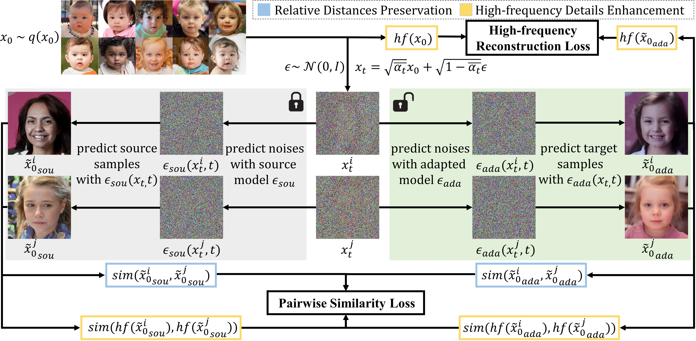
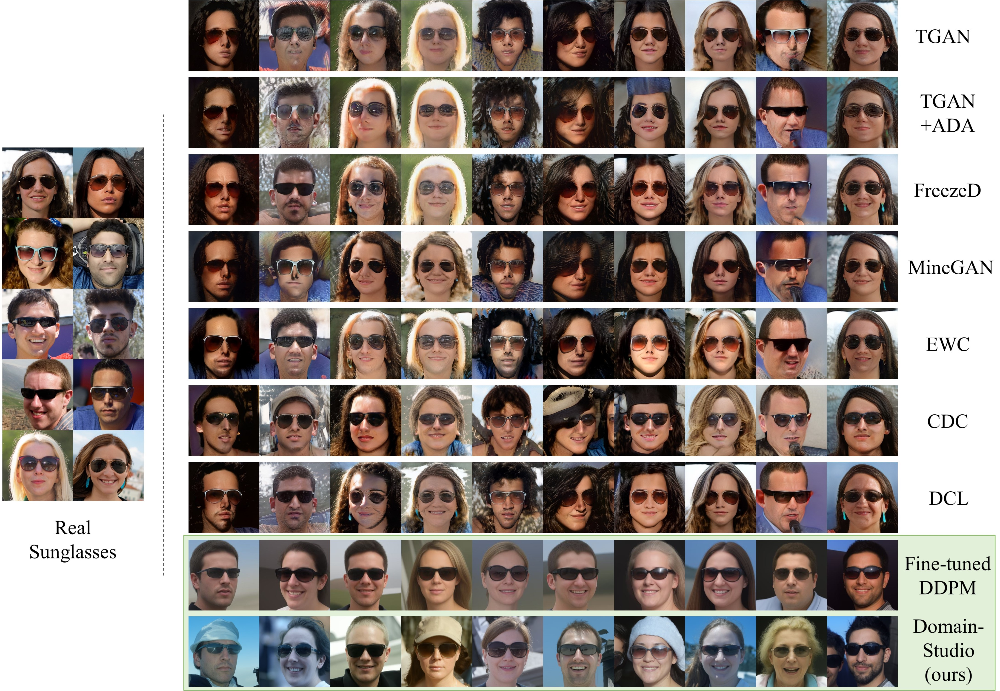
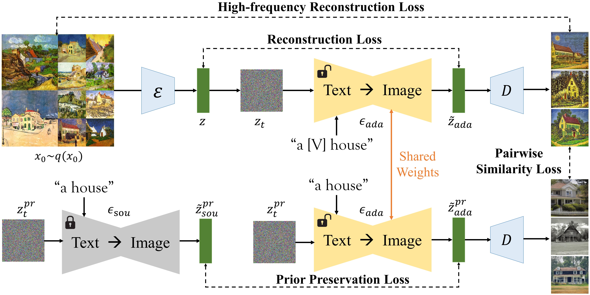

# DomainStudio
DomainStudio is a few-shot domain-driven generation method for diffusion models (preprint: arxiv 2306:14153). It is compatible with unconditional DDPMs and conditional text-to-image models (Stable Diffusion). The code are provided in the two files separately.

## Unconditional
Our code is based on [openai/improved-diffusion](https://github.com/openai/improved-diffusion, "Unconditional Diffusion"). We train source models on FFHQ and LSUN-Church and adapt them to several target domians using 10-shot limited data.

Pipeline of our DomainStudio for unconditional image generation:

Generated Samples:

## Text-to-Image
Our code is based on [huggingface/diffusers](https://github.com/huggingface/diffusers, "SD1.4"). We use Stable Diffusion V1.4 as the source model and realize domain-driven generation using limited data.

Pipeline of our DomainStudio for text-to-image generation:

Generated Samples:

